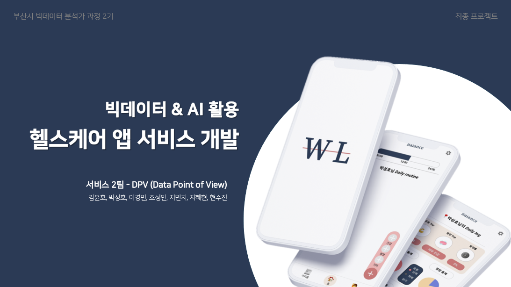
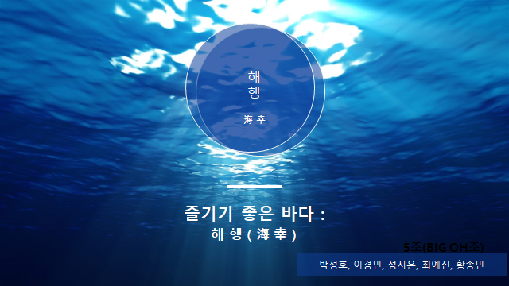

<h1 align="center">
  
</h1>

  

私はデータエンジニアリングとデータ分析に強い関心を持つ **パク・ソンホ**です。
 

 
  
**目次**
      
- **[1. 使用技術 (MY Tech Stack)](#1)**
- **[2. プロジェクト](#2)**
  - [2-1. Recipe_Manager](#3)
  - [2-2. ヘルスケアアプリサービス開発](#4)
  - [2-3. 健康機能食品服用分析プロジェクト](#5)
  - [2-4. 海幸 (ヘヘン)](#6)
- **[3. 学外活動 (Extracurricular Activities)](#7)**
  - [3-1. 🏆 開発コンテスト (2023)](#8)
  - [3-2. 💡 BDIAハッカソン (2023)](#9)
  - [3-3. 💡 ICTビジネスアイデアコンテスト (2023)](#10)
- **[4. 自己紹介 (ME)](#11)**
      
  

<h2 align="center">
🛠 使用技術 (MY Tech Stack)
</h2>

 

 

<h2 align="center">
💼 プロジェクト
</h2>

  

## 1. Recipe_Manager

ハンドドリップレシピや料理レシピを効率的に管理し、日本語会話学習を支援する **Flutterベースのモバイルアプリケーション**です。

  

#### 🛠 Tech Stack

- **Language:** `Python`
- **Frontend:** `Flutter` (Dart), `fl_chart` (データ可視化), `just_audio` (オーディオ再生), `record` (オーディオ録音)
- **Backend**: `Firebase Firestore` (リアルタイムNoSQLデータベース), `Firebase Storage` (オーディオファイル保存), `Firebase Cloud Functions` (サーバーレスバックエンドロジック), `Firebase Cloud Messaging` (プッシュ通知)
- **Version Control**: GitHub

---

 

  

## 2. ヘルスケアアプリサービス開発

健康的な習慣、正しい栄養摂取、そして楽しいヘルスケアをサポートする **ビッグデータ＆AI活用ヘルスケアアプリサービス**

  

#### 🛠 Tech Stack

- **Language:** `Python` (FastAPI), `JavaScript/TypeScript` (React Native)
- **Frontend:** `React Native` (クロスプラットフォーム)
- **Backend/Data Processing**: `FastAPI` (RESTful API), `Hadoop` (大規模データ処理および分散ストレージ), `Spark` (大容量データ分析および処理), `MariaDB` (リレーショナルデータベース)
- **Tools/Deployment**: `Airflow` (データワークフローのスケジューリング), `Jenkins` (デプロイ自動化), `Git` (バージョン管理), `Slack` (チームコミュニケーション)

---

 

  

## 3. 健康機能食品服用分析プロジェクト

健康機能食品の推薦、効能および用法を提供する **Djangoベースの健康機能食品分析**

  

#### 🛠 Tech Stack

- **Language:** `Python`
- **Framework/Database:** `Django`, `Oracle`
- **Data Analysis/Visualization**: `Pandas`, `NumPy`, `Matplotlib`, `Folium`
- **Tools/Deployment**: `Jupyter Notebook`, `Openpyxl`, `Pytest`, `Git`

---

 

  

## 4. 海幸 (ヘヘン)

安全に対する警戒心を喚起しつつ、楽しめる海洋情報を提供する **Webスクレイピング＆Open API活用海洋情報分析**

  

#### 🛠 Tech Stack

- **Language:** `Python`
- **Data Collection:** `BeautifulSoup`, `Selenium`, `Open API` (紫外線、体感温度、全国海水浴場のリアルタイム状況、クラゲ)
- **Data Processing/Visualization**: `Pandas`, `NumPy`, `Matplotlib`, `Seaborn`, `Folium`, `Excel`
- **Collaboration Tools**: `Notion`, `Slack`, `Google Drive`

---

  

<h2 align="center">
💡 学外活動 (Extracurricular Activities)
</h2>
 

  

## 🏆 開発コンテスト (2023)

  
  

- **参加:** ビッグデータベースサービスアイデア競技会、8人チームプロジェクト
- **成果:** ベストテック賞受賞、K-fold交差検定およびデータ可視化を担当
- **Tech:** `Python`, `Pandas`, `Numpy`, `OpenCV`, `Plotly`, `Matplotlib`, `seaborn`, `TensorFlow`, `Scikit-learn`, `Dlib`

---
 

  

## 💡 BDIAハッカソン (2023)

  

- **参加:** `CLOVA Studio`を活用したサービスMVP開発、5人チームプロジェクト
- **成果:** `Text-To-Image`および感情分析モデル開発
- **Tech:** `Python`, `Pandas`, `Numpy`, `Django`, `FastAPI`, `ncloud`(CLOVA Sentiment, CLOVA Studio, CLOVA Summary)

---
 

  

## 💡 ICTビジネスアイデアコンテスト (2023)

  

- **参加:** 第4回ICTビジネスモデルアイデア競技会、4人チームプロジェクト
- **成果:** アイデア企画およびデータ駆動型サービスモデル提案、データ収集
- **Tech:** `Python`, `Pandas`, `NumPy`, `Matplotlib`, `Seaborn`, `BeautifulSoup`, `Selenium`, `Open API`

---
 

 
  
<h2 align="center">
👀 自己紹介 (ME)
</h2>

  
  

