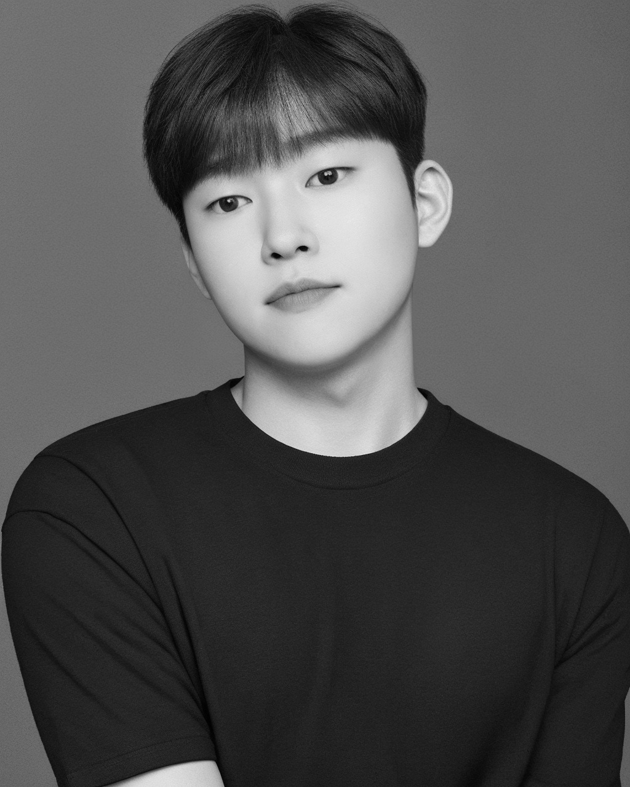

<h1 align="center">
  
</h1>

 

안녕하세요! 👋
  
저는 데이터 엔지니어링과 데이터 분석에 관심이 많은 **박성호**입니다.
  

 
  
**목차**
      
- **[1. MY Tech Stack](#1)**
- **[2. Project](#2)**
  - [2-1. Recipe_Manager](#3)
  - [2-2. 헬스케어 앱 서비스 개발](#4)
  - [2-3. 건강기능식품 복용 분석 프로젝트](#5)
  - [2-4. 해행(海幸)](#6)
- **[3. extracurricular activities](#7)**
  - [3-1. 🏆 Dev Contest (2023)](#8)
  - [3-2. 💡 BDIA Hackathon (2023)](#9)
  - [3-3. 💡 ICT Biz Idea Contest (2023)](#10)
- **[4. ME](#11)**
      
  

<h2 align="center">
🛠 MY Tech Stack
</h2>

 

 

<h2 align="center">
💼 Project
</h2>

  

## 1. Recipe_Manager

핸드드립 레시피와 요리 레시피를 효율적으로 관리하고, 일본어 회화 학습을 지원하는 **Flutter 기반 모바일 애플리케이션**

  

#### 🛠 Tech Stack

- **Language:** `Python`
- **Frontend:** `Flutter` (Dart), `fl_chart` (데이터 시각화), `just_audio` (오디오 재생), `record` (오디오 녹음)
- **Backend**: `Firebase Firestore` (실시간 NoSQL 데이터베이스), `Firebase Storage` (오디오 파일 저장), `Firebase Cloud Functions` (서버리스 백엔드 로직), `Firebase Cloud Messaging` (푸시 알림)
- **Version Control**: GitHub

---

 

  

## 2. 헬스케어 앱 서비스 개발

건강한 습관, 올바른 영양 섭취, 즐거운 헬스케어를 도와줄 **빅데이터 & AI활용 헬스케어 앱 서비스**

  

#### 🛠 Tech Stack

- **Language:** `Python` (FastAPI), `JavaScript/TypeScript` (React Native)
- **Frontend:** `React Native` (크로스플랫폼)
- **Backend/Data Processing**: `FastAPI` (RESTful API), `Hadoop` (대규모 데이터 처리 및 분산 스토리지), `Spark` (대용량 데이터 분석 및 처리), `MariaDB` (관계형 데이터베이스)
- **Tools/Deployment**: `Airflow` (데이터 워크플로우 스케줄링), `Jenkins` (배포 자동화), `Git` (버전 관리), `Slack` (팀 커뮤니케이션)

---

 

  

## 3. 건강기능식품 복용 분석 프로젝트

건강기능 식품의 추천 및 효능과 용법을 제공하는 **Django 기반 건강기능식품 분석**

  

#### 🛠 Tech Stack

- **Language:** `Python`
- **Framework/Database:** `Django`, `Oracle`
- **Data Analysis/Visualization**: `Pandas`, `NumPy`, `Matplotlib`, `Folium`
- **Tools/Deployment**: `Jupyter Notebook`, `Openpyxl`, `Pytest`, `Git`

---

 

  

## 4. 해행(海幸)

안전에 대한 경각심을 일깨워주면서 즐기기 좋은 해양 정보를 제공하는 **웹 스크래핑 & Open API 활용 해양 정보 분석**

  

#### 🛠 Tech Stack

- **Language:** `Python`
- **Data Collection:** `BeautifulSoup`, `Selenium`, `Open API` (자외선, 체감온도, 전국 해수욕장 실시간 상태, 해파리)
- **Data Processing/Visualization**: `Pandas`, `NumPy`, `Matplotlib`, `Seaborn`, `Folium`, `Excel`
- **Collaboration Tools**: `Notion`, `Slack`, `Google Drive`

---

  

<h2 align="center">
💡 extracurricular activities
</h2>
 

  

## 🏆 Dev Contest (2023)

  
  

- **참여:** 빅데이터 기반 서비스 아이디어 경진대회, 8인 팀 프로젝트
- **성과:** 베스트테크상 수상, K-fold Cross Validation 및 Data Visualization 담당
- **Tech:** `Python`, `Pandas`, `Numpy`, `OpenCV`, `Plotly`, `Matplotlib`, `seaborn`, `TensorFlow`, `Scikit-learn`, `Dlib`

---
 

  

## 💡 BDIA Hackathon (2023)

  

- **참여:** `CLOVA Studio`를 활용한 서비스 MVP 개발, 5인 팀 프로젝트
- **성과:** `Text-To-Image` 및 감정분석 모델 개발
- **Tech:** `Python`, `Pandas`, `Numpy`, `Django`, `FastAPI`, `ncloud`(CLOVA Sentiment, CLOVA Studio, CLOVA Summary)

---
 

  

## 💡 ICT Biz Idea Contest (2023)

  

- **참여:** 제4회 ICT 비즈니스 모델 아이디어 경진대회, 4인 팀 프로젝트
- **성과:** 아이디어 기획 및 데이터 기반 서비스 모델 제안, 데이터 수집
- **Tech:** `Python`, `Pandas`, `NumPy`, `Matplotlib`, `Seaborn`, `BeautifulSoup`, `Selenium`, `Open API`

---
 

 
  
<h2 align="center">
👀 ME
</h2>

  
  

