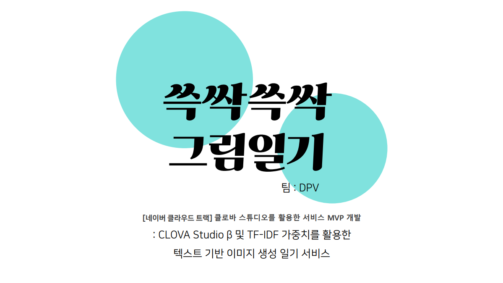

<h1 align="center">
  
</h1>

<h2 align="center">
🛠 MY Tech Stack
</h2>

 

 
<h2 align="center">
💼 Project
</h2>

  
  

  
  

  
  

<!-- 개인 프로젝트 추가 -->
 
<h2 align="center">
💡 extracurricular activities
</h2>

  
  

  

 
<h2 align="center">
👀 ME
</h2>

  
  
  

